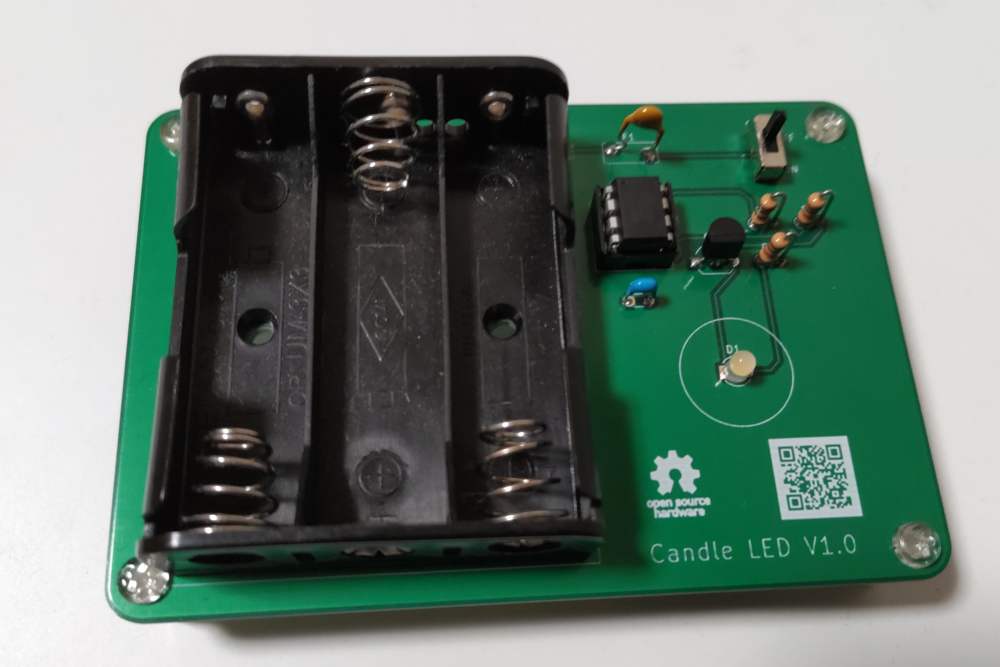

# 1/fゆらぎLEDキャンドルキット

## 概要

プログラム書込み済みのマイコン、プリント基板、LEDなどの部品をセットにした組み立てキットです。
このキットでは、LEDの明るさをマイコンで1/fゆらぎになるように制御しています。
マイコンを使用することで、ロウソクの光り方に近いリアルなゆらぎを再現しています。

#### お問い合わせフォーム
[製品に関するお問い合わせ](https://forms.gle/Fn5E3byABXJ8P5sbA)

#### 取扱説明書

<table>
  <thead>
    <tr>
      <th>バージョン</th>
      <th>URL</th>
    </tr>
  </thead>
  <tbody>
    <tr>
        <td>初版</td>
        <td><a href="https://naoto64.github.io/Candle-LED-Control-Unit/manual_20230726.pdf">manual.pdf</a></td>
    </tr>
    <tr>
        <td>最新版</td>
        <td><a href="https://naoto64.github.io/Candle-LED-Control-Unit/manual.pdf">manual.pdf</a></td>
    </tr>
  </tbody>
</table>

## 製作例

## 回路図

