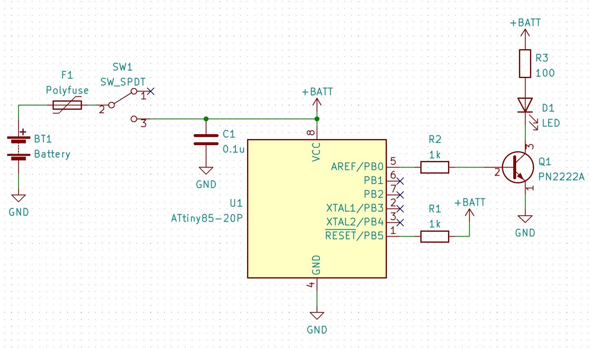

# 1/fゆらぎLEDキャンドルキット

## 概要

プログラム書込み済みのマイコン、プリント基板、LEDなどの部品をセットにした組み立てキットです。
このキットでは、LEDの明るさをマイコンで1/fゆらぎになるように制御しています。
マイコンを使用することで、ロウソクの光り方に近いリアルなゆらぎを再現しています。

#### 取扱説明書

<table>
  <thead>
    <tr>
      <th>バージョン</th>
      <th>URL</th>
    </tr>
  </thead>
  <tbody>
    <tr>
        <td>最新版</td>
        <td><a href="https://naoto64.github.io/Capacitive-Rain-Sensor/manual.pdf">manual.pdf</a></td>
    </tr>
  </tbody>
</table>

## 完成イメージ写真

## 回路図

